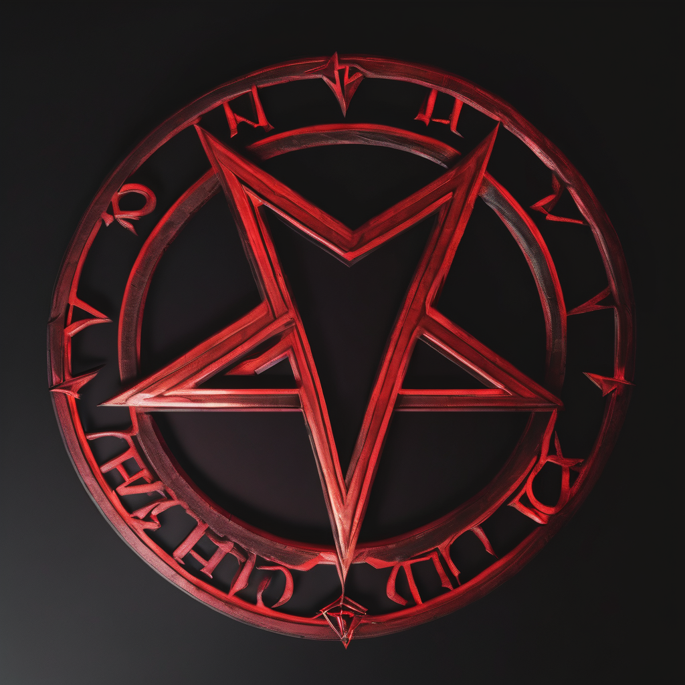
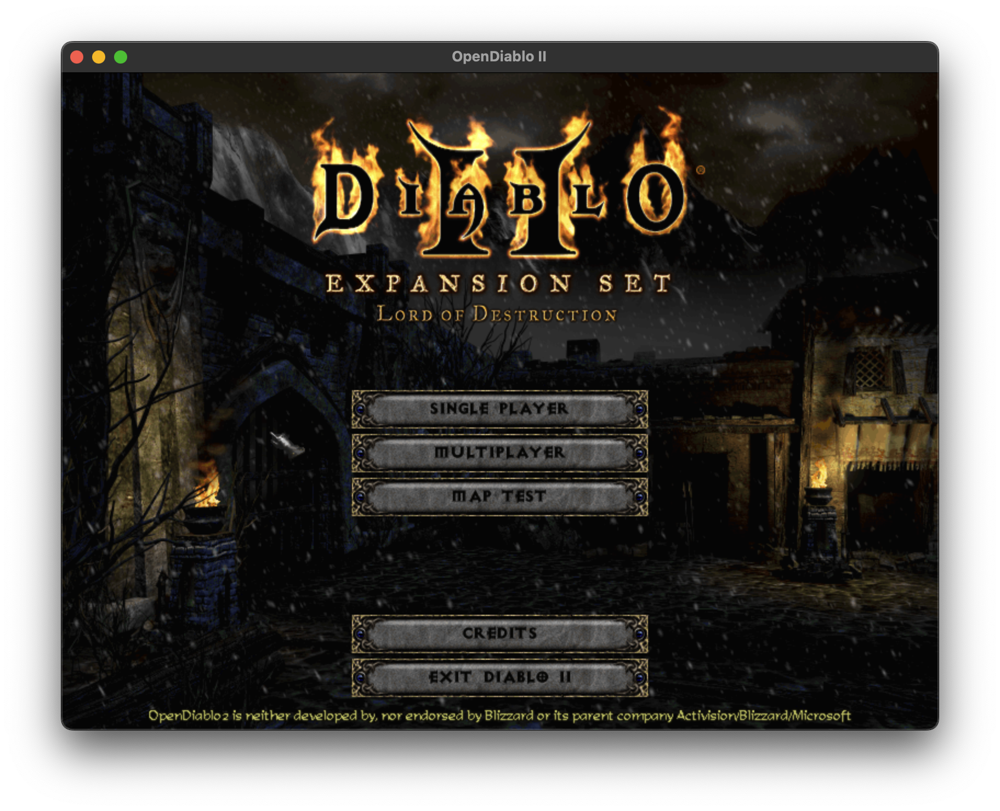
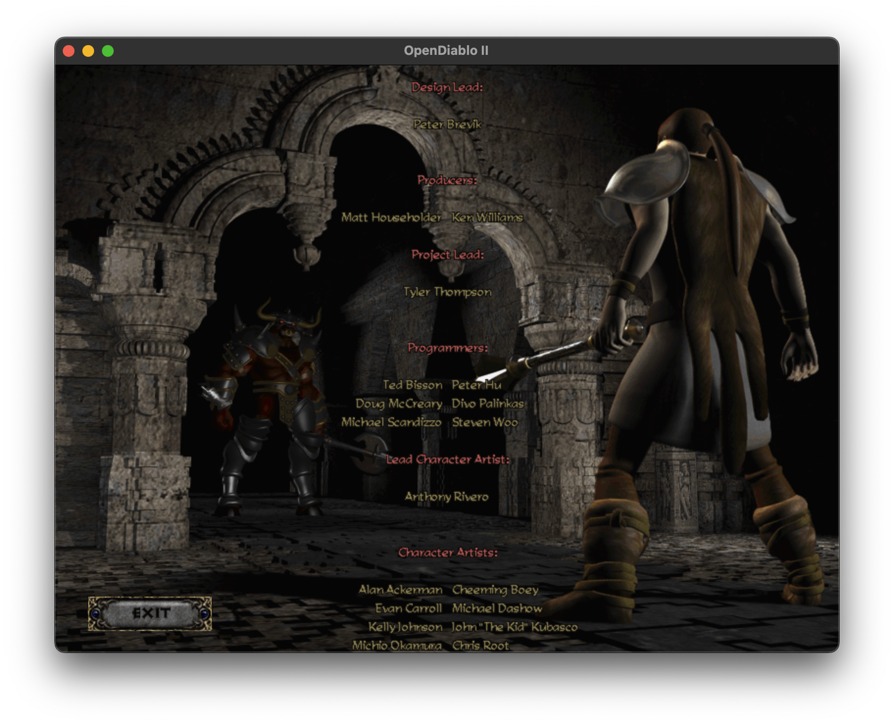
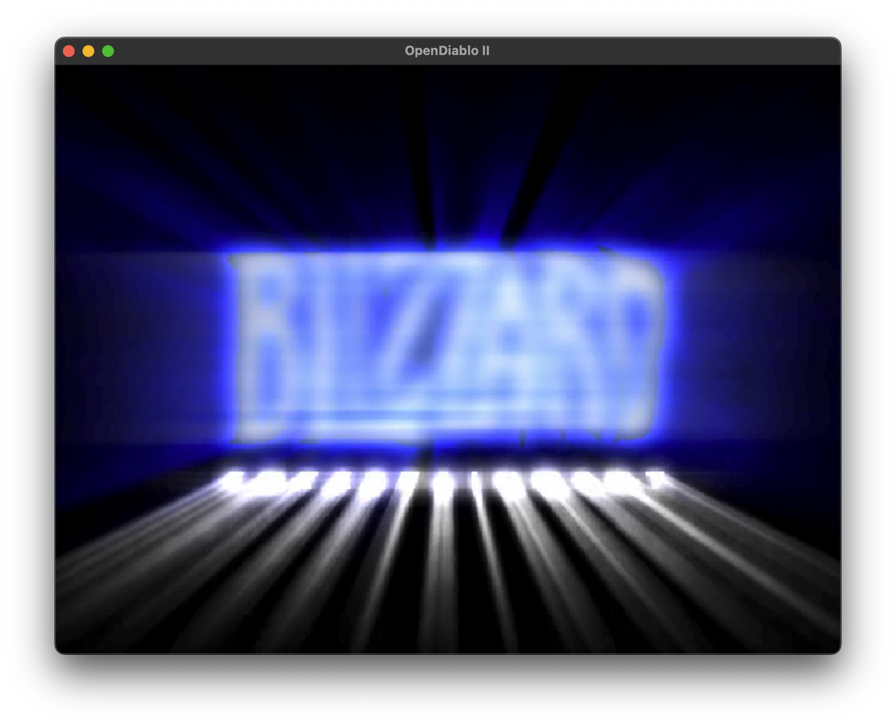

#  Abyss Engine

Join us on IRC: [irc.libera.chat #opendiablo2](https://web.libera.chat/#opendiablo2)

---

Abyss Engine is a game engine designed to run games similar to 2000's style ARPGs such as Diablo II.
This repository provides the **core engine** as well as **OpenDiablo2**, an open-source re-implementation of Diablo II using the engine.

----

We only support users who are using an official and legally owned copy of the original game. If you do not
have a copy of the game and/or do not use a Windows computer, it is recommended that you purchase the Windows edition of
the [Diablo 2](https://us.shop.battle.net/en-us/product/diablo-ii) and [LOD Expansion](https://us.shop.battle.net/en-us/product/diablo-ii-lord-of-destruction)
from the Blizzard store directly, and install/patch it on another machine, or in a virtual machine in order to obtain the MPQ files.

MPQs/disks downloaded from unofficial sources are not supported - please do not waste developer time on reporting issues involving mods/hacks or illegal
obtained MPQs.

## FAQ

***What is Abyss Engine?***\
Abyss Engine is a game engine designed to run games similar to 2000's style ARPGs such as Diablo II._

***Can it be used for other games?***\
Currently, the engine is designed to run Diablo II. However, it is possible to use the engine for other games, but it would require a lot of work.

***Is it playable yet?***\
No, it is not playable yet. We expect another 3 to 6 months of development before we can release a playable version.

***How can I help?***\
We're not actually looking for developers. All we need is a community to help us test the engine and report bugs. If you're interested in helping, please join
our Discord server!

## What is done?

* DC6 (image) and DT1 (map tile) rendering 🎨
* All Data Tables 📋
* Video Playback 🎥
* Font Rendering 🔤
* GUI Controls 🖱️

## What's currently being worked on?

* Map Rendering 🗺️
* Map generation ⚙️
* Screen Layouts 🏗️

## Installation

### Building from Source

1. Install [vcpkg](https://vcpkg.io/en/getting-started.html) (don't forget to `vcpkg integrate install` if you use
   Visual Studio!)
2. Either open the CMake project via Visual Studio, or use `-DCMAKE_TOOLCHAIN_FILE=...` option to cmake as described in
   vcpkg docs in your favorite IDE or shell.

Note for package maintainers: if all the C++ dependencies are found on the system already, vcpkg shouldn't be needed.

## Screenshots

