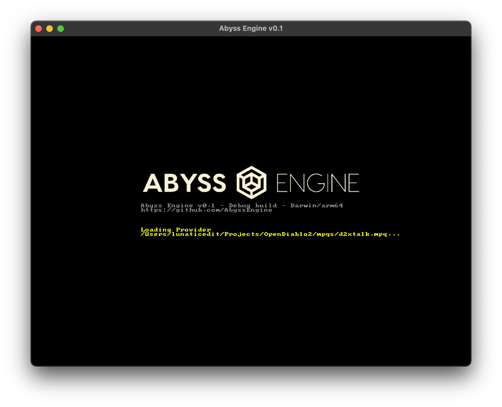

# AbyssEngine Engine

Join us on IRC: [irc.libera.chat #opendiablo2](https://web.libera.chat/#opendiablo2)

----
AbyssEngine is a game engine designed to run games similar to 2000's style ARPGs such as Diablo II.

This repository provides the core
engine [AbyssEngine Engine](https://github.com/AbyssEngine/AbyssEngine/tree/main/abyssengine), as well as
the [AbyssEngine Toolset (abt)](https://github.com/AbyssEngine/AbyssEngine/tree/main/abysstoolset). It also includes the
library [libAbyss](https://github.com/AbyssEngine/AbyssEngine/tree/main/libabyss), which is used by this project, and
can be used by 3rd party applications as well.

__*NOTE:*__ This is just the engine core. It will not run by itself. Please see a list of game projects below for a list
of what can be ran with this engine.

----

## Game Projects

The following are a list of game projects based on the AbyssEngine Engine:

| Game | Description |
| ---  | ----------- |
| [OpenDiablo2](https://github.com/AbyssEngine/OpenDiablo2) | An open-source re-implementation of Diablo II |

----

## Screenshots

## Installation

Binaries for Windows and MacOS are provided at [this page](https://github.com/AbyssEngine/AbyssEngine/releases/tag/unstable).

If you want to build from source instead, or if you use another OS (e.g. Linux):

1. Install [vcpkg](https://vcpkg.io/en/getting-started.html) (don't forget to `vcpkg integrate install` if you use
   Visual Studio!)
2. Install [luarocks](http://luarocks.github.io/luarocks/releases/) - just have luarocks.exe available in PATH,
   otherwise you'll need to explicitly provide path to it to cmake.
3. Either open the CMake project via Visual Studio, or use `-DCMAKE_TOOLCHAIN_FILE=...` option to cmake as described in
   vcpkg docs.

Note for package maintainers: if all the C++ and Lua dependencies are found on the system already, vcpkg and luarocks
shouldn't be needed.
