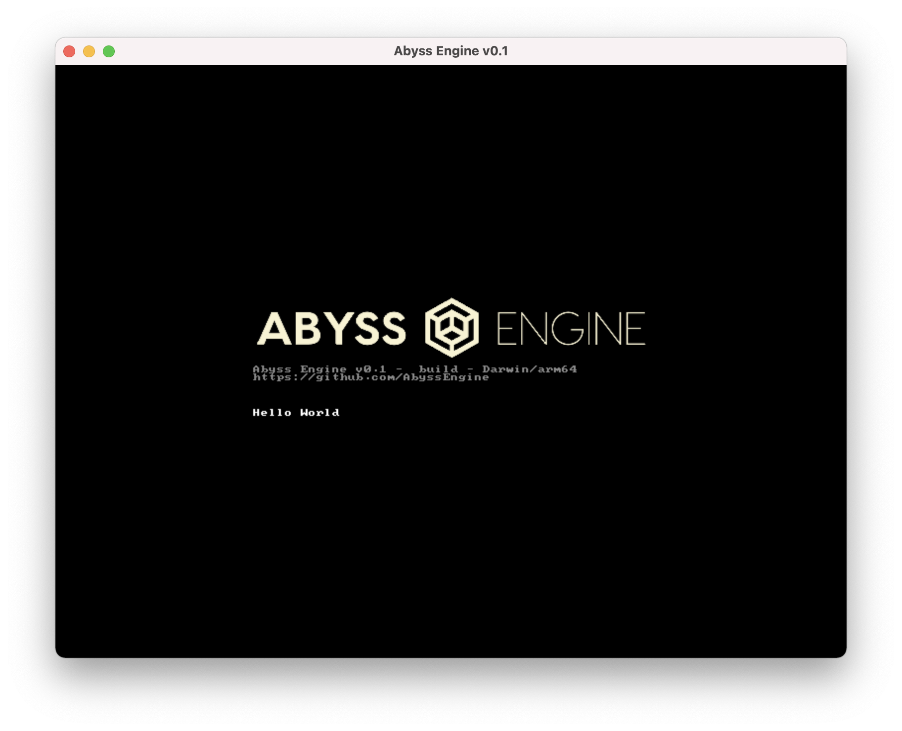

# Engine Functions

These are the functions available from lua in the Abyss Engine scripting environment

---

## getConfig

```lua
function getConfig(category, value): string
```

Returns the value of a configuration element.  
Category/Value is based on the INI file.  
A system category `"#Abyss"` has the following properties:

`"BasePath" - The base path of the engine`

### getConfig Example

```lua
function testConfigGet(): string
    return getConfig("Foo", "Bar")
end
```

```ini
[Foo]
Bar=test
```

Would return a string with the value `"test"`

---

## log

```lua
function log(level, message)
```

Writes message to the log.

**!!NOTE!!** Loglevel is INFO in release builds, bear this in mind if you need to display useful info in a log

`level: Log severity level, valid values are: "info", "error", "fatal", "warn", "debug", "trace"`

`message: Message to be printed`

### log Example

```lua
log("info", "Hello World!")
```

This Prints something along these lines:

```log
11:48:22 INFO  bootstrap.lua:1: Hello World!
```

---

## showSystemCursor

```lua
function showSystemCursor(show)
```

Shows/hides the system cursor

`show: Boolean value for showing/hiding system cursor`

---

## shutdown

```lua
function shutdown()
```

Shuts down the engine (exits)

---

## sleep

```lua
function sleep(msec)
```

Sleeps for the specified number of milliseconds

### sleep Example

This waits for 1 second and says `"I've been waiting so long"`

```lua
sleep(1000)
log("info", "I've been waiting so long")
shutdown()
end
```

---

## setBootText

```lua
function setBootText(text)
```

Sets the boot text (in boot mode), i.e the text before the main menu

**Note**: You can add colour by escaping a html colour hex value, e.g `\#FFFF00`

### setBootText Example

```lua
-- Hide the OS cursor (This is optional)
showSystemCursor(false)

-- Set boot text
setBootText("Hello World")
```

This gets displayed like this:



---

## addLoaderProvider

```lua
function addLoaderProvider(type, path)
```

Adds a location that resources can be loaded from, resources are loaded from the earliest added loader provider

`type is "mpq" or "filesystem"`

`path is either a path to an mpq file or a directory`

**Note**: The base directory is always loaded as a filesytem provider with the highest priority

### addLoaderProvider Example

This is the mpq loader code from [OpenDiablo2](https://github.com/AbyssEngine/OpenDiablo2)

```lua
-- Load global configuration values
basePath = getConfig("#Abyss", "BasePath")
mpqRoot = getConfig("System", "MPQRoot")
mpqs = split(getConfig("System", "MPQs"), ",")
mpqs = split(getConfig("System", "MPQs"), ",")

-- Create load providers for all of the available MPQs
for i in pairs(mpqs) do
    mpqPath = basePath .. "/" .. mpqRoot .. "/" .. mpqs[i]
    loadStr = string.format("Loading Provider %s...", mpqPath)
    log("info", loadStr)
    setBootText("\\#FFFF00 " .. loadStr)
    addLoaderProvider("mpq", mpqPath)
end
```

---

## loadString

**TODO**: Add Example For loadString

```lua
function loadString(path): string
```

Loads a resource and returns the data as a string

`path is the resource location to load`

---

## exitBootMode

```lua
function exitBootMode()
```

Exits boot mode and enters run mode

---

## loadPalette

```lua
function loadPalette(paletteName, path)
```

Loads a palette from the specified path and assigns it to the name.

---

## loadSprite

```lua
function loadSprite(path, paletteName): sprite
```

Loads a sprite based on the specified path and assigns the named palette to it.

---

## setCursor

```lua
function setCursor(sprite, offsetX, offsetY)
```

Sets the engine cursor to the specified sprite.

Offset X/Y offsets the sprite relative to the actual mouse position.

---

## getRootNode

```lua
function getRootNode(): node
```

Returns the root node in the engine's scene graph.
